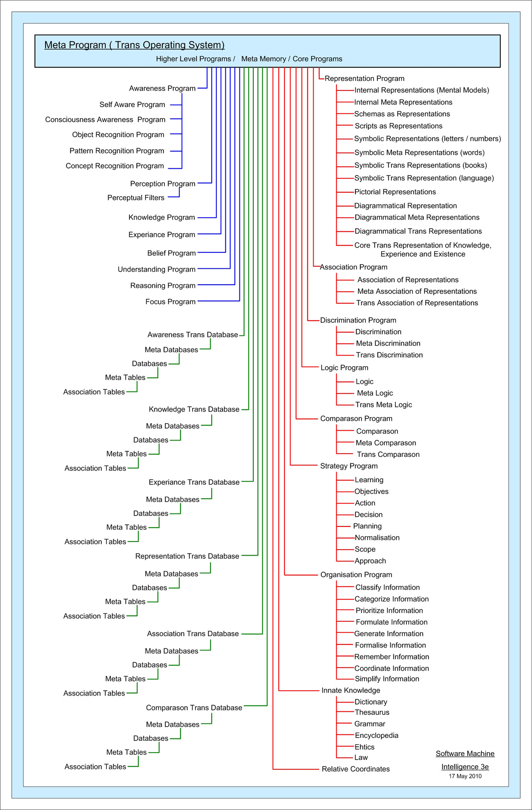

## Trump v. V.O.S. Selections

Oral arguments today in Trump v. V.O.S. Selections , a landmark case challenging President Trump's tariff impositions. At stake: whether Congress impermissibly delegated taxing authority to the executive branch under Section 232, 301, and 201 of the Trade Expansion Act. Waiting on RSS feed of today's oral hearing to drop. Analysis coming soon.

<a href="news.html" title="News">📰 News</a>

## October ADP Employment and Treasury Yield Update

Private sector employment increased by 42,000 jobs in October 2025 per ADP following a revised loss of 29,000 jobs in September.
This marked a rebound from two months of weak hiring, though the gains were modest and not broad-based. The report highlighted strong growth in trade, transportation, and utilities (+47,000), education and health services (+26,000), and financial activities (+11,000), offset by losses in professional business services (-15,000), information (-17,000), and leisure and hospitality (-6,000).

  <canvas id="adp-chart" width="400" height="200"></canvas>

The 10-year U.S. Treasury yield average for October was 4.06% representing a 2 basis point decline from September's 4.08%. This move reflected growing market expectations for Federal Reserve rate cuts, with yields pressured lower by dovish FOMC commentary and softening inflation data. The yield curve remained inverted, with the 2-year Treasury at 3.45%, though the spread narrowed slightly amid speculation of monetary policy easing.

  <canvas id="yield-chart" width="400" height="200"></canvas>

<a href="financials.html" title="Financials">📊 Financials</a>

## FOMC December Decision

Prediction markets show decreasing conviction for a 25 basis point Federal Reserve rate cut at the December FOMC meeting, with Kalshi and Polymarket aggregating probabilities at 65% for a quarter-point decrease versus 32% for no change. This shift in sentiment reflects mounting concerns over labor market cooling and below-target inflation readings, though market participants remain divided on the timing and magnitude of further cuts.

  <canvas id="fomc-chart" width="400" height="200"></canvas>

<a href="financials.html" title="Financials">📊 Financials</a> 

## Soft Determinism

In today's [journal entry](journal.html), reflections on technological determinism and free will emerged amid frustrations with AI-driven trading systems that exhibited hyper-aggressive behavior without contextual memory. The entry questioned whether human agency remains irreplaceable in investment decisions, contrasting AI's data-driven approach with Warren Buffett's emphasis on long-term sagaciousness.

For more real-time updates and interactive charts on ADP employment data, Treasury yields, FOMC rate predictions, and other financial indicators, visit our [News](news.html) page for breaking headlines or the [Financials](financials.html) dashboard for categorized metrics and trends.

<a href="journal.html" title="Journal"> Journal</a>

## Fascist Footlong

A 23-year CBP officer has mustard on his uniform and an onion on his radio antenna as a result of a "punctuation to a verbal outburst" from an anti-fascist.

Sources: [ADP Research Institute (October 2025 Private Employment Change)](https://www.adpresearch.com); [Federal Reserve Economic Data (10-Year Treasury Constant Maturity Rate)](https://fred.stlouisfed.org/series/DGS10); [Kalshi (FOMC December Rate Decision)](https://kalshi.com/markets/kxfeddecision/fed-meeting/kxfeddecision-25dec); [Polymarket (Fed Decision in December)](https://polymarket.com/event/fed-decision-in-december).

